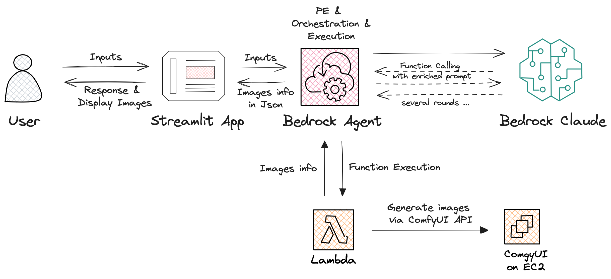

# Demo for Bedrock Agent calling ComfyUI API

### Scenario:     

Based on your inputs, Bedrock will extract image description then enrich and rewrite it into a Stable Diffusion prompt. After that, it will automatically call ComfyUI by leveraging Bedrock Agent to generate an image for you  

> User inputs can be any language, but eventually, a generated prompt for Stable Diffusion will be English  

> The best input for creating images is providing image description directly, if you provide irrelevant, Claude will ask you for more input, it may cause some confusions, such as prompt not always English, prompt is not enriched, still needs more PE  

> A default "ml.t3.medium" SageMaker notebook instance is sufficient to run the demo（excluding ComfyUI env. You need to set it up first）  

> Check this [repo](https://github.com/terrificdm/stable-diffusion-ComfyUI-ec2) to install ComfyUI on an EC2 srv by AWS CDK   

### How to use:     
Import bedrock_claude_agent_ComfyUI.ipynb to a SageMaker notebook instance, then run it as instructions described